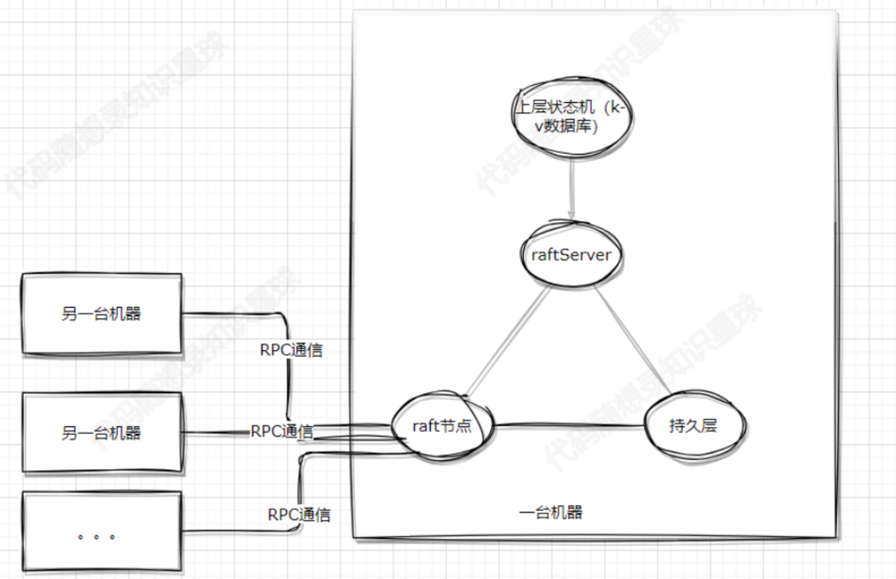

# 基于Raft的 key-value 存储数据库

### 项目背景

在当今大规模分布式系统的背景下，需要可靠、高可用性的分布式数据存储系统。

传统的集中式数据库在面对大规模数据和高并发访问时可能面临单点故障和性能瓶颈的问题。

为了解决这些问题，本项目致力于构建一种基于Raft一致性算法的分布式键值存储数据库，以确保数据的一致性、可用性和分区容错性。

### 目的

学习了Raft算法之后手动实现，并基于此搭建了一个k-v存储的分布式数据库。

### 解决的问题

- 一致性： 通过Raft算法确保数据的强一致性，使得系统在正常和异常情况下都能够提供一致的数据视图。
- 可用性： 通过分布式节点的复制和自动故障转移，实现高可用性，即使在部分节点故障的情况下，系统依然能够提供服务。
- 分区容错： 处理网络分区的情况，确保系统在分区恢复后能够自动合并数据一致性。

### 技术栈
- `Raft一致性算法`： 作为核心算法，确保数据的一致性和容错性。
- `存储引擎`： 使用适当的存储引擎作为底层存储引擎，提供高效的键值对操作。目前选择的是跳表，但是可以替换为任意k-v数据库。

### 项目范围
项目的初始版本将实现基本的Raft协议和键值存储功能。

后续版本可能包括性能优化、安全性增强、监控和管理工具的开发等。

### 前置知识储备
在学习该项目之前，必须知道的内容有：

- 语言基础，比如：mutex  ，什么是序列化和反序列化
- RPC相关，至少要知道什么是RPC

最好知道的内容有：

- c11的部分新特性：auto  、RAII 等
- 分布式的基础概念：容错、复制等

### 收获
Raft共识算法的快速理解

基于共识算法怎么搭建一个分布式的k-v数据库

需要注意的是，分布式式的共识算法实现本身是一个比较严谨的过程，因为其本身的存在是为了多个服务器之间通过共识算法达成一致性的状态，从而避免单个节点不可用而导致整个集群不可用，因此在学习过程中必须要考虑不同情况下节点宕机、断网情况下的影响。

许多情况需要仔细思考并实验以验证算法正确性，其中的思考别人无法代替，本项目的内容只能作为分布式共识算法Raft的一个入门的实现，方便大家快速理解Raft算法，从而写到简历上，如果想全部理解分布式算法的精髓只能多思考多看多总结。

### 项目大纲

项目的大概框图如下：

项目大概可以分为以下几个部分：

- raft节点：raft算法实现的核心层，负责与其他机器的raft节点沟通，达到 分布式共识 的目的。
- raftServer：负责raft节点与k-v数据库中间的协调服务；负责持久化k-v数据库的数据（可选）。
- 上层状态机（k-v数据库）：负责数据存储。
持久层：负责相关数据的落盘，对于raft节点，根据共识算法要求，必须对一些关键数据进行落盘处理，以保证节点宕机后重启程序可以恢复关键数据；对于raftServer，可能会有一些k-v数据库的东西需要落盘持久化。
- RPC通信：在 领导者选举、日志复制、数据查询、心跳等多个Raft重要过程中提供多节点快速简单的通信能力。

目前规划中没有实现节点变更功能或对数据库的切片等更进阶的功能，后面考虑学习加入。

在多个机器启动后，各个机器之间通过网络通信，构建成一个集群，对这样的集群，其对外表现的就像一台单机的k-v数据库一样，且少数节点出现故障不会影响整个集群的工作。

因此有了Raft算法的集群k-v数据库相对于单机的k-v数据库：

优势：集群有了容错的能力，可以理解成Raft算法可以保证各个机器上的k-v数据库（也称状态机）以相同的顺序执行外部命令。

劣势：容错能力需要算法提供，因此程序会变得复杂；需要额外对数据进行备份；需要额外的网络通信开销。

也是因此，其实上层的k-v数据库可以替换成其他的组件，毕竟只是一个状态机而已。

目前设计的后续主要内容：

1.Raft算法的一些概念性内容，比如：Raft算法是什么？Raft算法怎么完成公式？完成Raft算法需要哪几个主要函数？需要哪几个主要的变量维护？

2.Raft算法的主要函数实现思路及代码，主要函数包括：AppendEntries   、 sendRequestVote 、 sendAppendEntries 、 RequestVote 等

3.其他部分组件，包括：RPC通信组件、k-v数据库、中间沟通数据库和raft节点的raftServer
